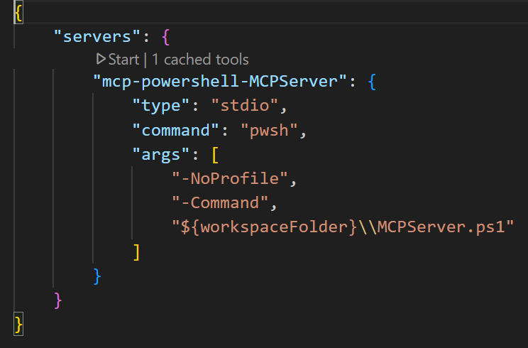

# VS Code Web Search MCP Server

This MCP (Model Context Protocol) server provides web search capabilities using the OpenAI 4o search LLM.

It allows LLMs to access up-to-date information from the web through a standardized interface.

## Features
- Native PowerShell MCP server
- Web search using OpenAI 4o search LLM
- Integration with VS Code for easy access

## Prerequisites

- PSMCP module
- PSAiSuite module
- OpenAI API key

## Installation & Setup
1. Clone the repository:
    ```powershell
    git clone https://github.com/yourusername/vscode-search-mcp.git
    ```
2. Install dependencies:
    ```powershell
    Install-Module -Name PSMCP, PSAiSuite
    ```
3. To use OpenAI Search you will need to [create an account](https://platform.openai.com/). After logging in, go to the [API Keys](https://platform.openai.com/api-keys) section in your account settings and generate a new key. Once you have your key, add it to your environment as follows:

    ```shell
    $env:OpenAIKey = "your-openai-api-key"
    ```

## Running the MCP Server using VS Code
- The MCP server is configured using a JSON file `mcp.json` file in the `.vscode` directory.
[server configuration](.vscode/mcp.json).

After opening the cloned repository in VS Code, you can start the MCP server by clicking `Start` at the top of the configuration file.



**Launch Copilot**:
- Start the server
- Click the `toggle chat` icon in the top right corner of the window to open the copilot chat interface. 
- Set the Copilot `mode` to `Agent`in the bottom right corner of the window.

VS Code Copilot should be able to find the search mcp server.